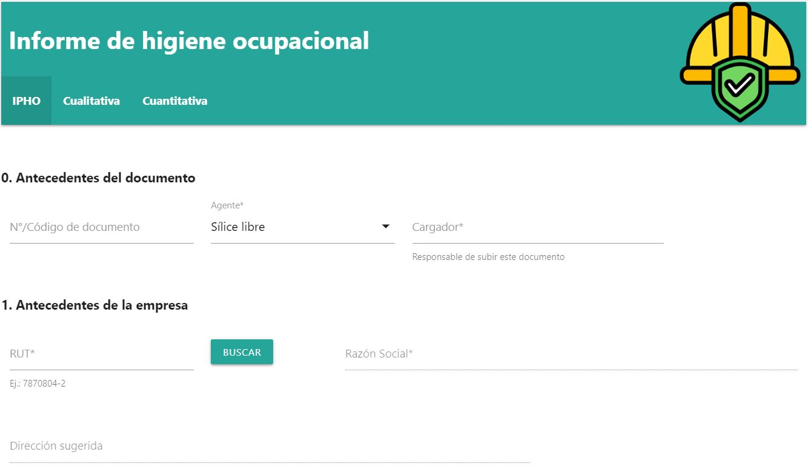

# GoogleForm

This Web App is a form that retrieves and sends data from and to multiple Google Spreadsheets for the purpose of data collection.

This web app was developed using Google Apps Script, an application development platform to create business applications that integrate with Google Workspace.

Apps Script is a coding language based on JavaScript and runs in the cloud on Google's servers.

Form language: **Spanish**

Purpose: digitalization of hand written reports

## Screenshots

## Tech Stack

- HTML
- JQuery
- CSS
- Javascript
- Google Apps Script

## Instructions

Usage Instructions:

1. Fill out all the fields marked with an asterisk (*). Refer to the examples provided below the input fields to help you complete the form.
2. Click the "Archivo" button to attach your document.
3. Click the "Enviar" button to submit the form.
4. Check the spreadsheet to see your submitted information.

## Live Demo

Link to form: [Link](https://script.google.com/macros/s/AKfycbxzKMUvsXmyA9cN3PX7IKS2hsqNTZZWKj7BgaYTtDCQMRSKNs0RJGTsxnubgar8uKnSIQ/exec)

Link to "general log" spreadsheet: [Link](https://docs.google.com/spreadsheets/d/16mUaovFGkyrTeXZTRWIpBiLg3tscEnXv188VFxmQjaE/edit?usp=sharing)

Link to "IPHO log" spreadsheet: [Link](https://docs.google.com/spreadsheets/d/1pOLp5v34kwNK6riHnb5Nc1DFOZVHzKtk_cN_jCBX3hU/edit?usp=sharing)
